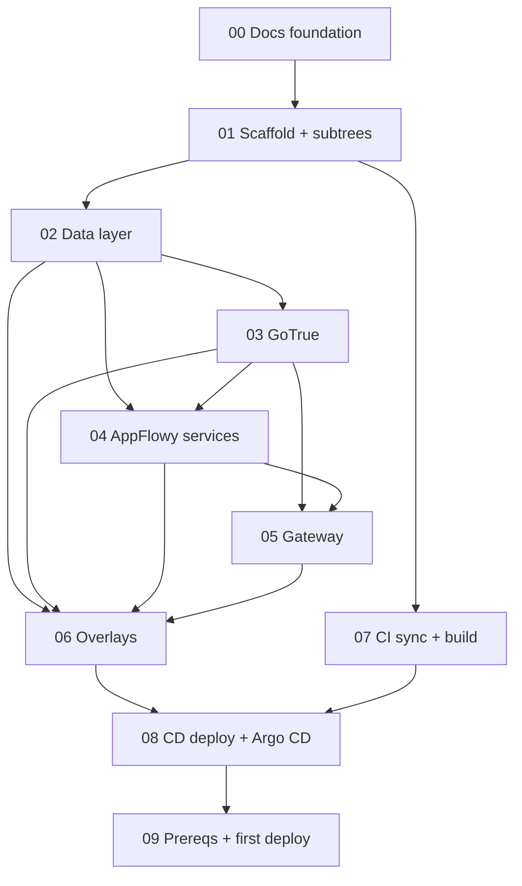

# Execution Roadmap

This roadmap breaks the [AppFlowy AGPL build design](./design/appflowy-agpl-build-design.md) into independently reviewable pull requests. Each PR has a self-contained task spec under [`docs/prs/`](./prs/) that an engineer (or agent) can pick up and execute without re-reading the whole design.

## PR Breakdown

| PR | Title | Spec | Depends on | Estimate |
|---|---|---|---|---|
| 00 | Docs and orchestration foundation | *(this branch)* | — | done |
| 01 | Repo scaffold and upstream subtrees | [spec](./prs/pr-01-repo-scaffold-and-subtrees.md) | 00 | 0.5d |
| 02 | Kubernetes base: data layer (CNPG, Redis) | [spec](./prs/pr-02-k8s-data-layer.md) | 01 | 0.5d |
| 03 | Kubernetes base: GoTrue auth | [spec](./prs/pr-03-k8s-gotrue.md) | 02 | 0.5d |
| 04 | Kubernetes base: AppFlowy services | [spec](./prs/pr-04-k8s-appflowy-services.md) | 02, 03 | 1d |
| 05 | Kubernetes base: gateway / HTTPRoute | [spec](./prs/pr-05-k8s-gateway.md) | 03, 04 | 0.5d |
| 06 | Kustomize overlays: prod and stage | [spec](./prs/pr-06-kustomize-overlays.md) | 02–05 | 0.5d |
| 07 | CI: upstream sync and image builds | [spec](./prs/pr-07-ci-sync-and-build.md) | 01 | 0.5d |
| 08 | CD: deploy workflow and Argo CD apps | [spec](./prs/pr-08-cd-deploy-and-argocd.md) | 06, 07 | 0.5d |
| 09 | Prereqs, secrets, first-time deploy | [spec](./prs/pr-09-prereqs-and-secrets.md) | 02–08 | 1d + 0.5d prep |

## Dependency Graph

## Parallelization

- **PR 07 (CI)** depends only on PR 01, so it can run in parallel with the entire PR 02 to 06 manifest track.
- The Kubernetes base components (PR 02, 03, 04, 05) have an internal ordering driven by runtime dependencies (services need their backends), but reviewers can stage PR 03 and PR 04 work concurrently once PR 02 lands.
- **PR 09** is mostly operational and overlaps GCP/DNS prep (the 0.5d) early; only the deploy/smoke-test portion is gated on PR 08.

## Out-of-Repo Work

Two pieces land in **`gpo-platform-configs`**, not this repo, and are called out in their specs:

1. The two Argo CD `Application` resources (canonical copies also kept in `kubernetes/argocd/` here). See [PR 08](./prs/pr-08-cd-deploy-and-argocd.md).
2. Confirmation that the CNPG operator, Gateway, and any ESO pattern already exist there. See [PR 02](./prs/pr-02-k8s-data-layer.md) and [PR 09](./prs/pr-09-prereqs-and-secrets.md).

## Carried Verifications

Three design assumptions must be verified during first deploy, each a tracked [Medium risk](./design/06-secrets-deployment-risks.md#risks). They do not block the manifest PRs but must be closed before go-live:

1. GCS works with AppFlowy's AWS S3 client (fallback: MinIO gateway).
2. `GOTRUE_EXTERNAL_GOOGLE_ALLOWED_DOMAINS` restricts to `gpo.ca` (fallback: app-layer check).
3. Server and client version pinning holds against a fast-moving upstream.

## Conventions for Executors

- One PR per spec; keep PRs reviewable. Do not bundle the manifest track into a single PR.
- Never commit secrets or rendered manifests. All sensitive values flow through `appflowy-secrets` or ESO.
- Validate every manifest PR with `kustomize build` and `kubeconform` before requesting review.
- Validate every workflow PR with `actionlint`.
- Do not edit `upstream/` source outside a dedicated, clearly labelled PR; it breaks subtree syncs.
